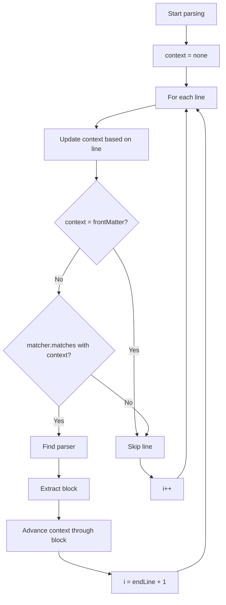

# Implement Context Tracking for Block Parser

## Overview

Add context state machine to track parsing context (none, code blocks, front matter) and prevent matching tags inside these regions. Design for easy extension with new context types.

## Architecture



## Changes

### 1. Add Context type in [`src/parsing/block-parser.ts`](src/parsing/block-parser.ts)

Add near top of file (after imports):

```typescript
type Context = 
  | { type: "none" }
  | { type: "codeFence"; delimiter: string };
```

Discriminated union - allows storing state per context type. Code fences store their delimiter so we match the correct closing fence. Easy to extend with new context types. Note: front matter handled separately (not a context).

### 2. Add helper functions in [`src/parsing/block-parser.ts`](src/parsing/block-parser.ts)

Add after Context type:

````typescript
function skipFrontMatter(lines: string[]): number {
  if (lines[0]?.trim() !== "---") return 0;
  
  for (let i = 1; i < lines.length; i++) {
    if (lines[i]?.trim() === "---") {
      return i + 1;
    }
  }
  return 0;
}

function nextContext(context: Context, line: string): Context {
  const trimmed = line.trim();
  
  if (context.type === "codeFence") {
    if (trimmed.startsWith(context.delimiter)) {
      return { type: "none" };
    }
    return context;
  }
  
  if (trimmed.startsWith("```")) {
    return { type: "codeFence", delimiter: "```" };
  }
  
  if (trimmed.startsWith("~~~")) {
    return { type: "codeFence", delimiter: "~~~" };
  }
  
  return context;
}
````

`skipFrontMatter`: Returns index to start parsing from (skips front matter if present at file start).

`nextContext`: Handles context transitions for code fences. Tracks delimiter to match correct closing fence (prevents  ```` ` from closing `~~~` block and vice versa).

### 3. Add context advance helper in [`src/parsing/block-parser.ts`](src/parsing/block-parser.ts)

Add after nextContext:

```typescript
function advanceContext(context: Context, lines: string[], from: number, to: number): Context {
  for (let i = from; i <= to; i++) {
    context = nextContext(context, lines[i] ?? "");
  }
  return context;
}
```

Keeps context in sync when parser jumps over extracted block.

### 4. Add CodeBlockParser class in [`src/parsing/block-parser.ts`](src/parsing/block-parser.ts)

Insert after HeadingBlockParser (around line 130):

````typescript
class CodeBlockParser extends BlockParser {
  matches(line: string): boolean {
    const trimmed = line.trim();
    return trimmed.startsWith("```") || trimmed.startsWith("~~~");
  }
  
  findEnd(lines: string[], startIndex: number): number {
    const startLine = lines[startIndex]?.trim();
    const delimiter = startLine?.startsWith("```") ? "```" : "~~~";
    
    for (let j = startIndex + 1; j < lines.length; j++) {
      const nextLine = lines[j];
      if (nextLine?.trim().startsWith(delimiter)) {
        return j;
      }
    }
    return lines.length - 1;
  }
}
````

Extracts entire fenced code block including opening/closing delimiters. Supports both  ```` ` (backticks) and `~~~` (tildes). Matches closing delimiter to opening delimiter.

### 5. Update blockParsers array in [`src/parsing/block-parser.ts`](src/parsing/block-parser.ts)

Change line 150:

```typescript
const blockParsers = [
  new CodeBlockParser(),
  new ListBlockParser(),
  new HeadingBlockParser(),
  new ParagraphBlockParser(),
];
```

Code blocks must be checked first (priority order matters).

### 6. Update LineMatcher interface in [`src/parsing/matchers.ts`](src/parsing/matchers.ts)

Change line 1-3:

```typescript
export type Context = 
  | { type: "none" }
  | { type: "codeFence"; delimiter: string };

export interface LineMatcher {
  matches(line: string, context: Context): boolean;
}
```

Export Context so matcher can use it. Context is required (not optional). Note: no frontMatter context since it's skipped before parsing.

### 7. Update TagMatcher in [`src/parsing/matchers.ts`](src/parsing/matchers.ts)

Update matches method (line 16):

```typescript
matches(line: string, context: Context): boolean {
  if (context.type === "codeFence") {
    return false;
  }
  
  const withoutInlineCode = line.replace(/`[^`]*`/g, "");
  return this.regexes.some((regex) => regex.test(withoutInlineCode));
}
```

Skip matches in code fences. Strip inline code before checking tags.

### 8. Update parseBlocks in [`src/parsing/block-parser.ts`](src/parsing/block-parser.ts)

Replace entire parseBlocks function (lines 157-190):

```typescript
export function parseBlocks(content: string, matcher: LineMatcher): Block[] {
  const lines = content.split("\n");
  const blocks: Block[] = [];
  let context: Context = { type: "none" };
  
  let i = skipFrontMatter(lines);
  while (i < lines.length) {
    const line = lines[i] ?? "";
    context = nextContext(context, line);
    
    if (!line || line.trim() === "") {
      i++;
      continue;
    }
    
    if (!matcher.matches(line, context)) {
      i++;
      continue;
    }
    
    const parser = blockParsers.find((p) => p.matches(line));
    if (!parser) {
      i++;
      continue;
    }
    
    const block = parser.extract(lines, i);
    blocks.push(block);
    
    context = advanceContext(context, lines, i, block.endLine);
    i = block.endLine + 1;
  }
  
  return blocks;
}
```

Key changes:

- Skip front matter before loop starts (if present)
- Track context starting at "none"
- Update context before matching
- Pass context to matcher
- Advance context after block extraction

## Extending with new contexts

To add new context type (e.g., HTML blocks):

1. Add to Context union: `| { type: "htmlBlock"; openTag: string }`
2. Add transition logic in nextContext function
3. Optionally handle in matcher (if should skip matches)

No other changes needed - architecture supports it. Each context type can store whatever state it needs.

Note: Front matter is not a context - it's skipped before parsing begins since it only appears at file start.

## Test expectations

After implementation:

- Code block with tag in fence (backticks or tildes) → extracted ✓
- Code block with tag only inside → skipped ✓
- Inline code with tag → ignored ✓
- Front matter → skipped before parsing begins ✓

Note: Indented code blocks (4 spaces) not handled - ambiguous with list indentation.